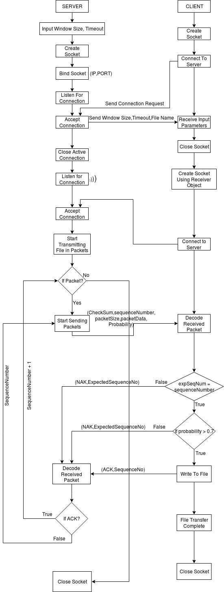

# Go-Back-N-Protocol-TCP

# Overview

A Python based system to implement the functionality of the Go Back N Protocol using the Transmission Control Protocol.
The Client- Server architecture is implemented in the files Sender.py and Reciever.py.

# Prerequisites

Python 2  
Python Socket Library  
Python HashLib Library

# Process

Initially, activate the server by running the Sender.py file.
After this, activate client by connecting to Server, run Reciever.py file.

Observe how data transfer occurs in the form of a stream because TCP is a Stream Oriented Protocol.

# Schematic View

